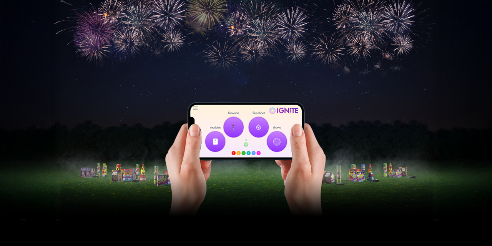
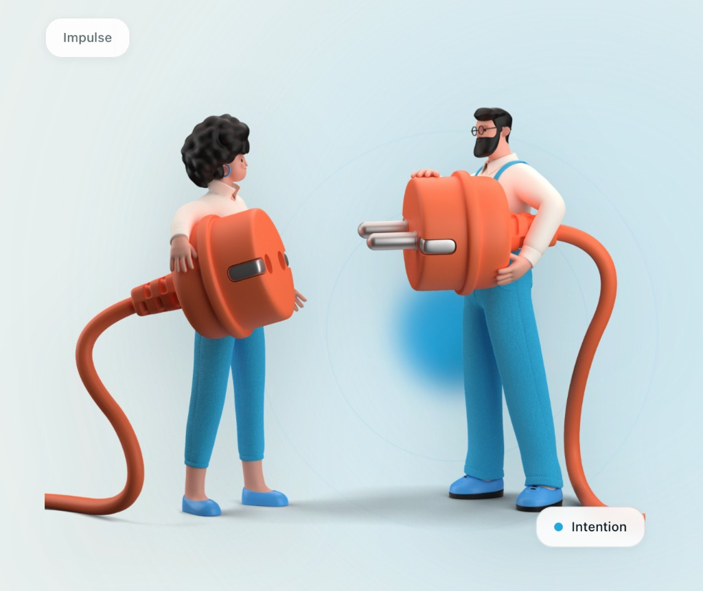
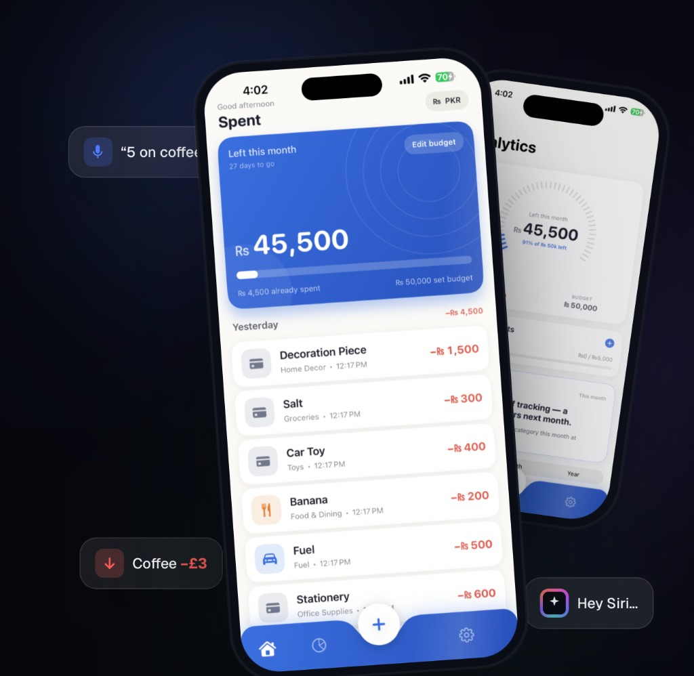
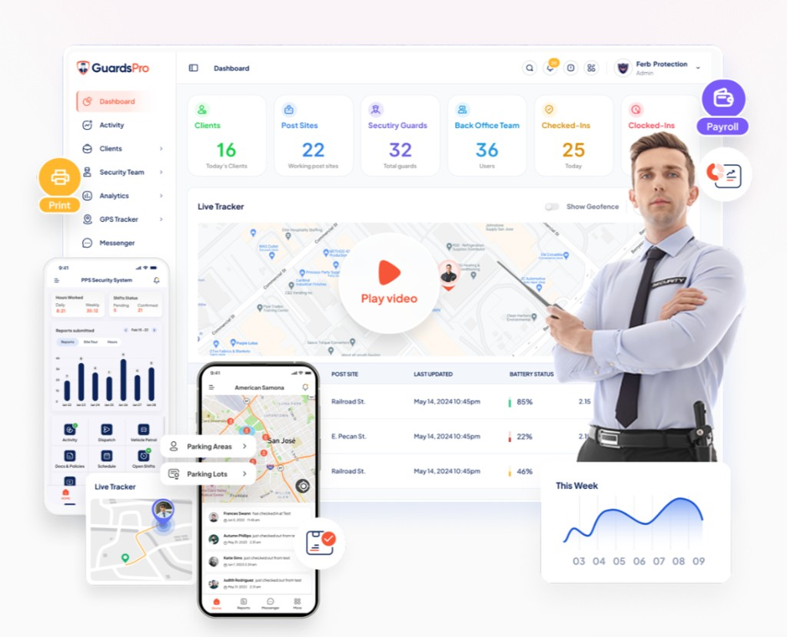
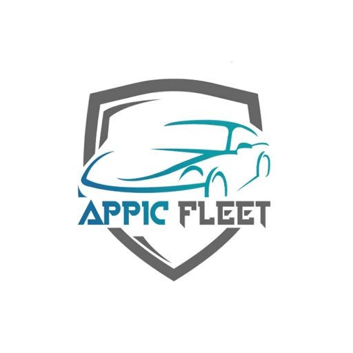
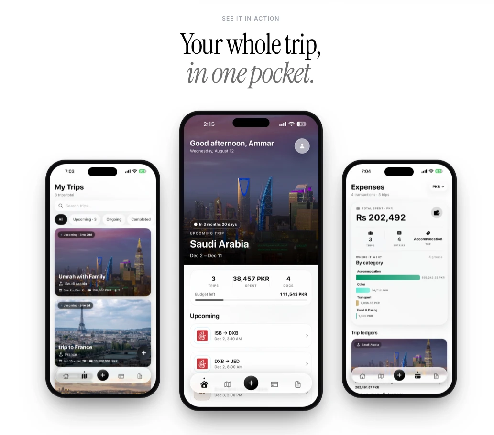
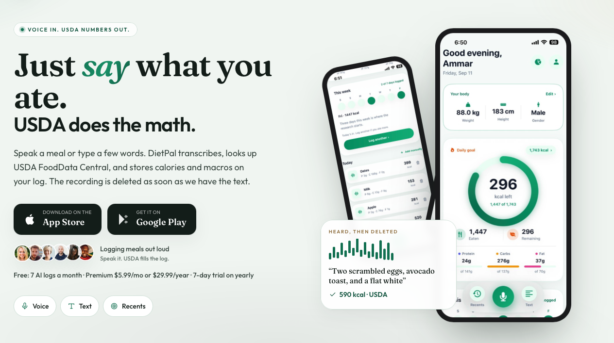

# Ammar Ul Haq

**Senior iOS Developer &amp; Team Lead** — Pakistan · Remote

[Portfolio](https://ammarulhaq.me) ·
[Email](mailto:amarulhak@gmail.com) ·
[LinkedIn](https://www.linkedin.com/in/ammar-ul-haq-045051a1/) ·
[Medium](https://medium.com/@amarulhak) ·
[GitHub](https://github.com/ammarulhaqn8n-rgb) ·
[Résumé (PDF)](Ammar-Ul-Haq-Resume.pdf)

> 10+ years building high-performance, native iOS apps — from real-time
> Bluetooth firing systems to social, fintech and enterprise products. Expert in
> Swift, SwiftUI, UIKit, BLE and real-time processing, with a track record of
> leading teams, owning the App Store release pipeline and shipping products
> people rely on every day.

 

## About

Senior iOS Developer and Team Lead with a decade of production experience
designing, building and optimizing mobile applications for clients in the US, UK
and beyond. I own the full lifecycle — architecture, implementation, CI/CD, App
Store release and post-launch iteration — and I gravitate toward the hard
problems: real-time systems, BLE / hardware integration, and apps where
reliability is non-negotiable. I also build modern web front-ends (React /
Next.js) when a product needs a companion site.

## Tech Stack

**Languages:** Swift · Objective-C · TypeScript

**iOS &amp; UI:** SwiftUI · UIKit · Combine · Core Graphics · AVFoundation ·
Vision · RealityKit · Auto Layout

**Architecture:** MVVM · TCA (The Composable Architecture) · VIPER · Clean
Architecture · Swift Package Manager · protocol-oriented dependency injection

**Concurrency &amp; performance:** Swift Concurrency (async/await, actors) · GCD ·
Metal · Instruments (Time Profiler, Allocations, Leaks)

**Real-time &amp; hardware:** Core Bluetooth (BLE) · NFC · Multipeer
Connectivity · WebSockets

**Networking &amp; data:** REST · GraphQL · Alamofire · URLSession · Codable ·
Core Data · SwiftData · CloudKit · Firebase (Firestore)

**Measurement &amp; growth:** Firebase Analytics · Crashlytics · Remote Config ·
Cloud Messaging · AppsFlyer (attribution + deep linking) · Universal Links /
Dynamic Links

**CI/CD &amp; delivery:** Fastlane (`match`) · Bitrise · Xcode Cloud · App Store
Connect (phased release, TestFlight) · App Privacy labels · ATT

**Testing:** XCTest · Quick / Nimble · Snapshot testing · Xcode Previews

**Web (full-stack):** React · Next.js · TypeScript · Tailwind CSS · Node.js

**Tooling:** Git / GitHub · SwiftLint / SwiftFormat · CocoaPods · SPM · JIRA ·
Figma · Agile / Scrum

## Employment History

| Period | Role | Company |
| --- | --- | --- |
| Nov 2018 – Present | Senior iOS Developer &amp; Team Lead | [IGNITE Firing Systems](https://www.ignitefiringsystems.com) (USA) · Remote |
| Aug 2017 – Oct 2018 | Senior iOS Developer | DPL · Pakistan |
| Nov 2016 – Sep 2017 | iOS Developer | Ifisol · Pakistan |
| Aug 2015 – Nov 2016 | iOS Developer (Part-time) | Binex Solutions · Pakistan |

### IGNITE Firing Systems — Senior iOS Developer &amp; Team Lead
- Lead and mentor the iOS team; own architecture, code reviews and technical direction.
- Built the **Core Bluetooth firing engine** — sub‑300ms precision with fail‑safe misfire protection on a deterministic paused timeline.
- Migrated UIKit → **SwiftUI + Combine → Swift Concurrency**; modular **MVVM / TCA** in SPM packages.
- **Firebase Analytics + Crashlytics** (crash‑free‑users as a release gate); **AppsFlyer** for paid‑social install attribution and deferred deep linking.
- **Fastlane + Bitrise / Xcode Cloud** CI/CD, automated TestFlight; App Store Connect phased releases.
- Automated firework sequencing that increased client revenue by **~30%**.

### DPL — Senior iOS Developer
- Built **TalkBack**, a social news app; modernized to MVVM + Codable networking.
- Firebase (Firestore, Auth, Cloud Messaging) for real‑time content and push; Branch / Dynamic Links deep linking.

### Ifisol — iOS Developer
- Developed the **Attendo** employee‑management app serving thousands of employees.
- Owned Ad Hoc / Enterprise / App Store distribution — provisioning, certificates and entitlements.

### Binex Solutions — iOS Developer (Part-time)
- Shipped multiple business apps; Objective‑C → Swift, AdMob / Chartboost, AFNetworking, CocoaPods.

## Education

| Period | Qualification | Institution |
| --- | --- | --- |
| 2012 – 2016 | BSCS — Bachelor of Computer Science | SZABIST University · Islamabad, Pakistan |

## Selected Apps

### IGNITE Firing Systems

[App Store](https://apps.apple.com/us/app/ignite-firing-systems/id1544453017) · [Website](https://www.ignitefiringsystems.com)

Smartphone-controlled fireworks firing system with life-safety-grade reliability. **Rated 4.9** on the App Store.
- **Real-time BLE engine:** Core Bluetooth (GATT) control of firing modules with **sub-300ms** latency, fail-safe handshakes and misfire guards.
- **Deterministic scheduling:** paused-timeline show engine; Multipeer Connectivity / WebSocket fallback for multi-module shows and background BLE state restoration.
- **Architecture:** SwiftUI + Combine → Swift Concurrency; modular **MVVM / TCA** in Swift Package Manager modules; Core Graphics / Metal firing-sequence visualizer.
- **Measurement &amp; delivery:** Firebase Analytics + Crashlytics, AppsFlyer attribution, Remote Config flags; Fastlane + Xcode Cloud → TestFlight, App Store Connect phased releases.

### PyroCast

[App Store](https://apps.apple.com/us/app/pyrocast/id1583221898)

Companion firing-system app in the IGNITE family for real-time control and show sequencing.
- Shares the **Core Bluetooth** real-time engine; low-latency module control and cue playback.
- Swift · **MVVM**; offline-capable show storage and reliable reconnection handling.

### Social Detox

[App Store](https://apps.apple.com/pk/app/social-detox/id6497330800) · [Website](https://socialdetox.auraapps.online)

Digital-wellbeing app that helps people reclaim focus and build healthier screen-time habits.
- Built on Apple's **Screen Time / Family Controls** (DeviceActivity + ManagedSettings) to block distracting apps and enforce focus schedules.
- **SwiftUI**; App Groups to share state with the shield extension; local notifications for focus sessions and usage insights.
- Companion marketing site tuned for SEO and conversion.

### Attendo Plus

[App Store](https://apps.apple.com/us/app/attendo-plus/id1260460403) · [Website](https://www.attendoplus.com)

Attendance management for organizations — native iOS app plus a web dashboard.
- Check-ins, live reports and rosters kept in sync via **REST**; **Core Data** offline cache with background sync.
- **APNs** push reminders, role-based access, and CSV/report exports for admins.
- Web dashboard companion for real-time monitoring across teams.

### Spent

[App Store](https://apps.apple.com/kz/app/spent-speak-it-its-saved/id6779672290) · [Website](https://www.spent.auraapps.online)

Voice-first personal expense tracking with smart budgeting.
- **Speech framework / Siri** voice capture — "speak it, it's saved" — with smart categorization.
- **SwiftUI + Swift Charts** for spend insights; Core Data / iCloud persistence and budget alerts.
- Product landing page with SEO and App Store deep links.

### GuardsPro

[App Store](https://apps.apple.com/us/app/guardspro-security-guard-app/id1238303335) · [Website](https://www.guardspro.com)

Security workforce management platform used by security companies in the field.
- **Live GPS** guard-tour tracking with Core Location + geofencing and checkpoint scans.
- **Offline-first** incident reporting (photos, notes) synced to the backend when connectivity returns.
- Scheduling, real-time dashboards and multi-role access across app and web.

### Appic Fleet

[App Store](https://apps.apple.com/us/app/appic-fleet/id6498920162)

Fleet-management app for logistics and vehicle tracking.
- **MapKit + Core Location** live vehicle tracking, routes and trip logging.
- REST backend integration with efficient background location updates.

### Roamie Travel

[Website](https://roamietravel.com)

AI trip-planning web app — trips, expenses and documents in one place.
- **React / Next.js + TypeScript** SPA with server-prerendered, SEO-optimized marketing pages.
- AI-assisted itinerary planning, expense tracking and shared trip ledgers; deferred deep links to the mobile app.

### DietPal

[Website](https://dietpal.auraapps.online)

Nutrition companion — describe what you ate and it does the USDA math.
- Voice/text meal logging that transcribes speech, looks it up in **USDA FoodData Central**, and stores calories &amp; macros.
- **Privacy-first:** the recording is deleted as soon as the text is captured.
- **Next.js** static export with trailing-slash routes, cached assets and a fast, mobile-first UI.

## Contact

- **Email:** amarulhak@gmail.com
- **Phone:** +92 331 5145607
- **Portfolio:** https://ammarulhaq.me
- **LinkedIn:** https://www.linkedin.com/in/ammar-ul-haq-045051a1/
- **Location:** Pakistan · available remote worldwide

This CV lives on GitHub. An interactive version with per-role deep dives is at
<a href="https://ammarulhaq.me/#career">ammar.auraapps.online</a>.
